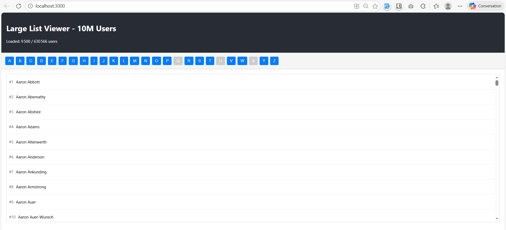

# Large List Viewer - Optimized for 10M+ Users

Une application web performante pour afficher et naviguer dans de très grandes listes d'utilisateurs (jusqu'à 10 millions) sans geler le navigateur.



## 🎯 Objectif

Cette application résout le problème classique d'affichage de grandes quantités de données dans un navigateur web. Au lieu de charger tous les éléments d'un coup (ce qui provoquerait un gel du navigateur), l'application utilise des techniques de virtualisation et de chargement progressif pour garantir des performances optimales.

##  Fonctionnalités

- **Virtual Scrolling** : Affichage uniquement des éléments visibles à l'écran pour optimiser les performances
- **Chargement progressif** : Chargement des données par chunks au fur et à mesure du scroll
- **Navigation par alphabet** : Menu A-Z pour naviguer rapidement vers une section spécifique
- **Compteur en temps réel** : Affichage du nombre d'utilisateurs chargés / total
- **Interface réactive** : Scroll fluide à 60 FPS même avec des millions d'éléments

##  Technologies Utilisées

### Backend
- **Node.js** avec Express.js
- Lecture de fichiers via streams pour gérer efficacement les gros fichiers
- API REST avec endpoints pour pagination et index alphabet

### Frontend
- **React** avec TypeScript
- Virtualisation personnalisée (sans dépendances externes lourdes)
- Axios pour les appels API

##  Installation

### Prérequis
- Node.js (v14 ou supérieur)
- npm ou yarn
- Un fichier `users.txt` contenant la liste des utilisateurs (un nom par ligne, trié par ordre alphabétique)

### Étapes d'installation

1. **Cloner le repository**
```bash
git clone <repo-url>
cd App_list
```

2. **Installer les dépendances du backend**
```bash
cd backend
npm install
```

3. **Placer votre fichier users.txt**
Placez votre fichier contenant les utilisateurs dans `backend/data/users.txt`

4. **Installer les dépendances du frontend**
```bash
cd ../frontend
npm install
```

##  Lancement

### Démarrage du backend

Dans un terminal, depuis le dossier `backend` :
```bash
npm start
```

Le serveur démarre sur `http://localhost:3001`

### Démarrage du frontend

Dans un autre terminal, depuis le dossier `frontend` :
```bash
npm start
```

L'application s'ouvre automatiquement dans le navigateur sur `http://localhost:3000`

##  Structure du Projet

```
App_list/
├── backend/
│   ├── data/
│   │   └── users.txt          # Fichier contenant les utilisateurs
│   ├── routes/
│   │   └── users.js           # Routes API pour les utilisateurs
│   ├── utils/
│   │   ├── fileReader.js      # Utilitaires de lecture de fichier
│   │   └── alphabetIndex.js   # Génération de l'index alphabet
│   ├── server.js              # Point d'entrée du serveur
│   └── package.json
├── frontend/
│   ├── src/
│   │   ├── components/
│   │   │   ├── VirtualList.tsx    # Composant de liste virtualisée
│   │   │   └── AlphabetMenu.tsx   # Menu de navigation A-Z
│   │   ├── hooks/
│   │   │   └── useInfiniteScroll.ts  # Hook pour le scroll infini
│   │   ├── services/
│   │   │   └── api.ts          # Appels API
│   │   └── App.tsx
│   └── package.json
└── README.md
```

##  Utilisation

1. **Affichage initial** : La première page d'utilisateurs se charge automatiquement
2. **Scroll infini** : Scrollez vers le bas pour charger automatiquement plus d'utilisateurs
3. **Navigation par lettre** : Cliquez sur une lettre dans le menu A-Z pour naviguer rapidement vers cette section
4. **Suivi du chargement** : Le compteur en haut affiche le nombre d'utilisateurs chargés sur le total


##  Optimisations Techniques

### Backend
- **Streaming** : Utilisation de streams Node.js pour lire les fichiers ligne par ligne sans charger tout en mémoire
- **Cache** : Cache de l'index alphabet et du total pour éviter de relire le fichier à chaque requête
- **Pagination efficace** : Calcul précis de l'offset pour accéder directement à la bonne position dans le fichier

### Frontend
- **Virtualisation** : Seuls les éléments visibles (et quelques éléments supplémentaires pour le buffer) sont rendus dans le DOM
- **Accumulation intelligente** : Les données chargées sont accumulées et triées pour maintenir l'ordre
- **Chargement par zones** : Lors de la navigation par alphabet, plusieurs pages sont chargées autour de la position ciblée pour une meilleure expérience
- **Gestion mémoire** : Évite de garder des doublons en mémoire grâce à un système de tracking des pages chargées

##  Problèmes Connus / Limitations

- Le fichier users.txt doit être trié par ordre alphabétique pour que la navigation par alphabet fonctionne correctement
- Pour des fichiers extrêmement volumineux (>10M lignes), la première génération de l'index alphabet peut prendre quelques secondes

##  Améliorations Futures Possibles

- Recherche par nom en temps réel
- Filtres avancés
- Export des résultats
- Tri personnalisé
- Pagination par curseur au lieu de pagination par offset


##  License

Ce projet est un exemple de démonstration.

---

